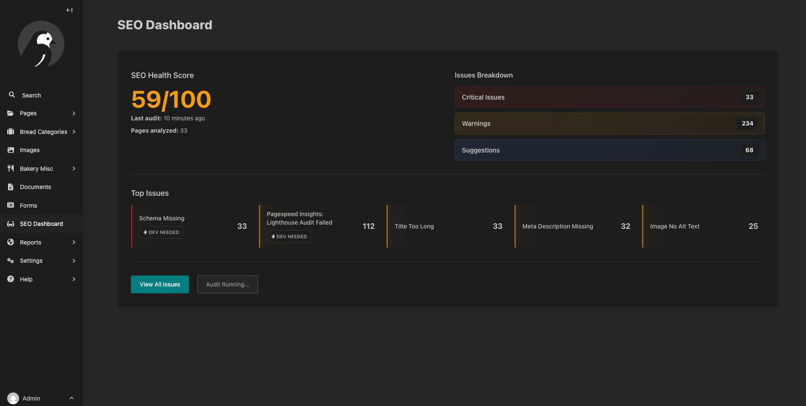
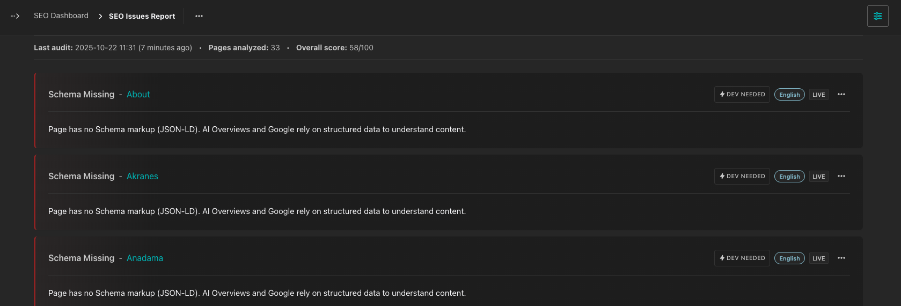
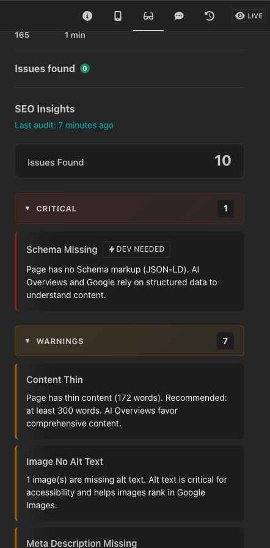

# Wagtail SEO Toolkit

A comprehensive SEO auditing and optimization plugin for Wagtail CMS that helps you identify and fix SEO issues across your website.



## 📋 Table of Contents

- [🚀 Features](#-features)
  - [🔍 SEO Best Practices Checks](#-seo-best-practices-checks)
  - [⚡ PageSpeed Insights Checks (Optional)](#-pagespeed-insights-checks-optional)
  - [🎯 Smart Issue Management](#-smart-issue-management)
  - [🔧 Flexible Configuration](#-flexible-configuration)
- [📸 Screenshots](#-screenshots)
- [🛠 Installation](#-installation)
- [⚙️ Configuration](#️-configuration)
- [🚀 Usage](#-usage)
  - [Running Audits](#running-audits)
- [🔧 Advanced Configuration](#-advanced-configuration)
- [🛠 Development](#-development)
- [📊 Performance Considerations](#-performance-considerations)
- [📝 Changelog](#-changelog)
- [📄 License](#-license)
- [🙏 Acknowledgments](#-acknowledgments)

## 🚀 Features

### 🔍 **SEO Best Practices Checks**
- **Title & Meta Tags**: Check for missing, duplicate, or suboptimal meta tags
- **Content Analysis**: Analyze content length, readability, and structure
- **Header Structure**: Validate H1-H6 hierarchy and usage
- **Image Optimization**: Check for missing alt text, proper sizing, and optimization
- **Schema Markup**: Validate structured data implementation
- **Mobile Optimization**: Ensure mobile-friendly design and viewport settings
- **Internal Linking**: Analyze internal link structure and distribution
- **Content Freshness**: Track content publication and modification dates

### ⚡ **PageSpeed Insights Checks** (Optional)
- **Performance Metrics**: Get Core Web Vitals and performance scores
- **Accessibility Checks**: Identify accessibility issues
- **Best Practices**: Check for security and modern web standards
- **SEO Performance**: Analyze technical SEO factors
- **Per-Page-Type Optimization**: Efficiently audit multiple pages of the same type

### 🎯 **Smart Issue Management**
- **Issues Export**: Export list of issues to Excel/CSV
- **Developer vs Content Issues**: Clear distinction between technical and content fixes

### 🔧 **Flexible Configuration**
- **PageSpeed Settings**: Control API usage and optimization
- **Button Visibility**: Control audit button visibility in admin
- **Dev Fix Filtering**: Show only content-editable issues

## 📸 Screenshots

### SEO Dashboard

*Comprehensive overview of your site's SEO health with actionable insights*

### Issues Report

*Detailed view of all SEO issues with filtering and management options*

### Page Sidebar


*Real-time SEO insights directly in the Wagtail page editor*

## 🛠 Installation

### Prerequisites
- Wagtail 6.4+

### Install via pip

```bash
pip install wagtail-seotoolkit
```

### Add to your Django settings

```python
# settings.py
INSTALLED_APPS = [
    # ... other apps
    'wagtail_seotoolkit',
]
```

### Run migrations

```bash
python manage.py migrate
```


## ⚙️ Configuration

### All Settings

```python
# settings.py

# SEO Toolkit Configuration
WAGTAIL_SEOTOOLKIT_SHOW_AUDIT_BUTTON = True  # Show audit button in admin (default: False)
WAGTAIL_SEOTOOLKIT_INCLUDE_DEV_FIXES = True  # Include developer-required fixes (default: True)

# PageSpeed Insights Configuration (Optional - must be manually enabled)
# Note: PageSpeed checks are disabled by default and must be manually enabled
WAGTAIL_SEOTOOLKIT_PAGESPEED_API_KEY = "your-api-key-here"  # Get from Google
WAGTAIL_SEOTOOLKIT_PAGESPEED_ENABLED = True  # Enable PageSpeed checks
WAGTAIL_SEOTOOLKIT_PAGESPEED_DRY_RUN = False  # Use real API calls
WAGTAIL_SEOTOOLKIT_PAGESPEED_PER_PAGE_TYPE = True  # Optimize API usage
```

### Getting a PageSpeed API Key

1. Visit [Google PageSpeed Insights API](https://developers.google.com/speed/docs/insights/v5/get-started)
2. Create a new project or select existing one
3. Enable the PageSpeed Insights API
4. Create credentials (API key)
5. Add the key to your settings

## 🚀 Usage

### Running Audits

This plugin exposes 2 management commands `seoaudit` and `run_scheduled_audits` those commands needs to be executed by some process. Smiliarly to [publish_scheduled](https://docs.wagtail.org/en/stable/reference/management_commands.html#publish-scheduled).

#### Option 1: User-Requested Audits (Recommended)

To allow users to request audits through the admin interface:

1. **Enable the audit button**:
   ```python
   # settings.py
   WAGTAIL_SEOTOOLKIT_SHOW_AUDIT_BUTTON = True
   ```

2. **Set up periodic task** to process scheduled audits:
   ```bash
   python manage.py run_scheduled_audits
   ```
WARNING: First audit needs to be started manually with `seoaudit` command.


#### Option 2: Automated Audits

Set up a scheduled task to run audits automatically:

```bash
python manage.py seoaudit
```


## 🔧 Advanced Configuration

### Filtering Dev Fixes

For content editors who shouldn't see technical issues:

```python
# settings.py
WAGTAIL_SEOTOOLKIT_INCLUDE_DEV_FIXES = False
```

This will hide all issues that require developer intervention, showing only content-related issues.

### PageSpeed Optimization

The `WAGTAIL_SEOTOOLKIT_PAGESPEED_PER_PAGE_TYPE` setting optimizes PageSpeed API usage for sites with many pages of the same type:

```python
# settings.py
WAGTAIL_SEOTOOLKIT_PAGESPEED_PER_PAGE_TYPE = True  # Enable optimization (default: False)
```

**How it works:**
- **When `True`**: Tests PageSpeed on only one page per page type (e.g., one BlogPage, one ProductPage)
- **When `False`**: Tests PageSpeed on every individual page
- **Result propagation**: PageSpeed issues found on the test page are applied to all pages of that same type

**Example:**
- Site has 50 BlogPage instances and 30 ProductPage instances
- **With optimization**: 2 PageSpeed API calls (1 for BlogPage + 1 for ProductPage)
- **Without optimization**: 80 PageSpeed API calls (1 for each page)

**Benefits:**
- **Cost savings**: Dramatically reduces Google PageSpeed API usage
- **Faster audits**: Significantly faster completion times
- **Same accuracy**: PageSpeed issues are typically consistent across pages of the same type

**When to use:**
- Sites with many pages of the same type
- When PageSpeed API costs are a concern
- For faster audit execution

## 🛠 Development

### Setting up Development Environment

You can start developing with this plugin using the Wagtail Bakery demo project that includes this plugin enabled:

```bash
# Clone the repository
git clone https://github.com/your-org/wagtail-seotoolkit.git
cd wagtail-seotoolkit

# Start the development environment with Docker
docker-compose up

# The plugin will be available at http://localhost:8000/admin/
# Login with: admin / changeme
```

## 📊 Performance Considerations

### PageSpeed API Limits
- Google PageSpeed Insights API has rate limits
- Use `WAGTAIL_SEOTOOLKIT_PAGESPEED_PER_PAGE_TYPE = True` for large sites
- Consider running audits during off-peak hours

## 📝 Changelog

### Version 0.1.7
- Initial release
- Comprehensive SEO auditing
- PageSpeed Insights integration
- Wagtail admin integration
- Configurable settings

## 📄 License

This project is licensed under the MIT License.

**Author**: WAYF

**Copyright**: © 2025 WAYF

For the full license text, see [LICENSE](LICENSE).

## 🙏 Acknowledgments

- Built for the Wagtail CMS community
- Inspired by modern SEO best practices
- Powered by Google PageSpeed Insights API
- Thanks to all contributors and users

---

**Made by WAYF**
